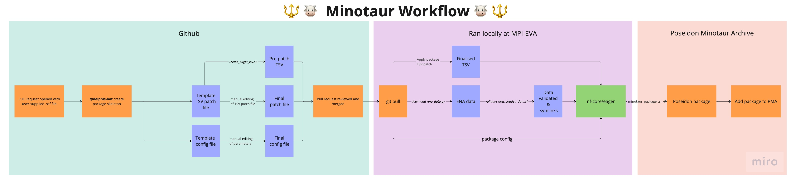

# minotaur-recipes

This repository holds all the recipes used to run the Poseidon Framework's
**Minotaur Workflow** and create poseidon packages.

The Minotaur workflow takes in sequencing metadata and URLs of publicly archived
raw sequencing data (provided by the community) and processes them in a flexibly
configurable yet reproducible manner to produce poseidon packages. These
poseidon packages are then added to the Poseidon Minotaur Archive (PMA), and
made available to everyone through
[`trident`](https://github.com/poseidon-framework/poseidon-hs), the poseidon
server-client infrastructure.

# The Minotaur Workflow

The Minotaur Workflow consists of three parts:

- Creating the Poseidon Package Skeleton
- Processing of the public data with [nf-core/eager](https://nf-co.re/eager)
- Poseidon Package preparation for upload to the PMA

Details on each part can be found below.

## Creating the Poseidon Package Skeleton

This is the community-facing entrypoint to the workflow, and takes place on the
[minotaur-recipes GitHub repository](https://github.com/poseidon-framework/minotaur-recipes),
when a contributor has opened a pull request to add/update a package. Once the
required SSF file has been updated, `delphis-bot` will create all the
SSF-associated auxilliary files required for processing.

Upon activation, `delphis-bot` will create:

- a precursor nf-core/eager TSV input file,
- the package `.config` file,
- the package `tsv_patch.sh` that can be ued to localise the TSV precursor into
  a valid input for nf-core/eager,
- a `script_versions.txt` file, with the versions of the scripts used during the
  package skeleton creation.

For a step-by-step guide on how to contribute to the PMA, see
[this guide](docs/contributing.md).

## Processing of data with nf-core/eager

This step takes place locally at [MPI-EVA](https://www.eva.mpg.de/index). The
machinery described in the
[poseidon-eager GitHub repository](https://github.com/poseidon-framework/poseidon-eager)
uses the package skeleton to:

- download the raw data from the public archive URLs in the SSF file (using
  `scripts/download_ena_data.py` and `scripts/run_download.sh`)
- Validate the downloaded data, and create symlinks with clearer naming
  (`scripts/validate_downloaded_data.sh`). This allows the one-to-many
  relationship between raw data and `poseidon_ids`.
- Apply the `*_tsv_patch.sh` of the package skeleton to create the finalised
  nf-core/eager TSV.
- Use `run_eager.sh` to run nf-core/eager.
  - This uses the finalised TSV as its input
  - And load the `.config` of the package skeleton to apply all default
    parameters, as well as any relevant `CaptureType` and package-specific
    parameters.

Once the data is processed, the genotyping output of nf-core/eager is used to
create a poseidon package. The metadata included in the janno file for this
package is then filled using descriptive statistics generated by nf-core/eager
and information from the SSF file.
